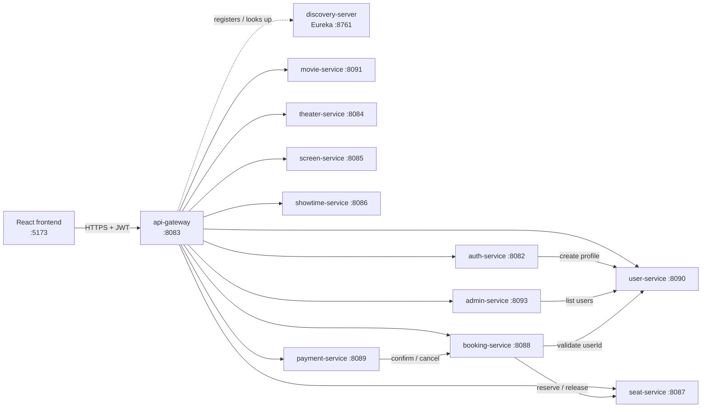
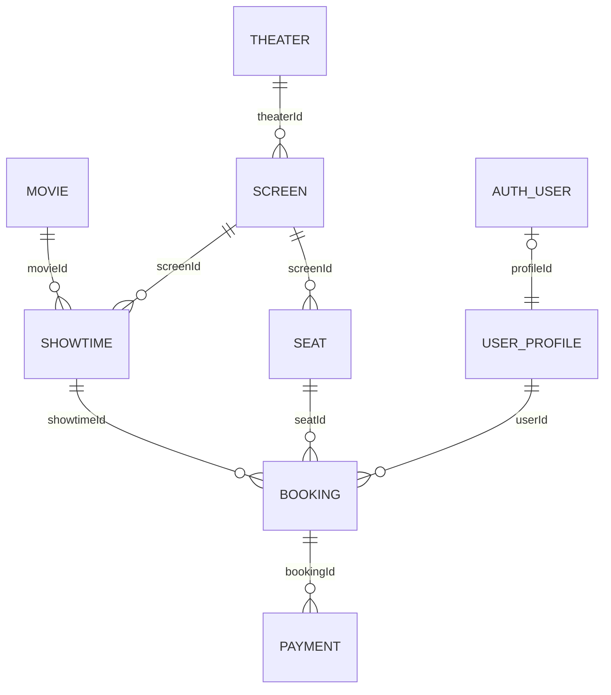
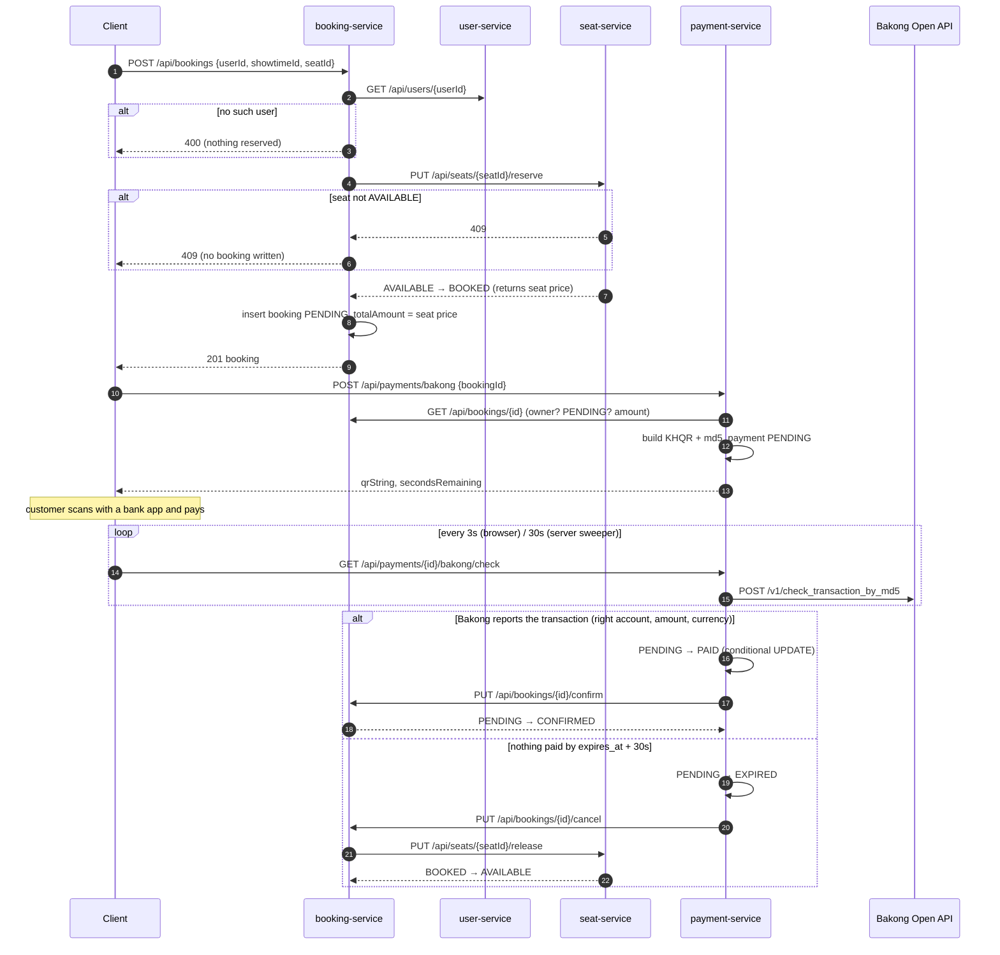

# Movie Booking System — Project Overview

A walkthrough of the whole project: what it is, how the pieces fit together,
how a ticket actually gets booked, and how to run it. For the deep dive on
service-to-service calls (RestClient, Eureka, timeouts, circuit breakers), see
[`service-communication.md`](service-communication.md).

---

## 1. What it is

**CineBook** is a movie-theater booking system built as **microservices**.
Users browse movies, pick a showtime and seats, book them, and pay. Admins
manage the catalogue (movies, theaters, screens, showtimes, seats).

| Layer | Technology |
| --- | --- |
| Backend | Java 21, Spring Boot 4.1.0, Spring Cloud 2025.1.2 |
| Service discovery | Netflix Eureka |
| Entry point | Spring Cloud Gateway (WebMVC flavour) |
| Security | JWT (jjwt, HS256), Spring Security |
| Resilience | Resilience4J circuit breakers + HTTP timeouts |
| Data | MySQL 8.4 — one database per service, schema owned by Flyway |
| Frontend | React 19, Vite 8, Tailwind 4, React Router 7 |
| Packaging | Docker + Docker Compose |
| Tests | `@SpringBootTest` smoke tests, Testcontainers concurrency test, bash end-to-end scripts |

---

## 2. The big picture



Key ideas:

- **One entry point.** The browser only ever talks to `api-gateway`. The
  gateway checks the JWT, decides whether the caller may do this, and routes
  the request to the right service by its Eureka name (`lb://seat-service`).
- **Twelve independent Maven projects.** Each has its own `pom.xml`, Maven
  wrapper, Dockerfile, and database. The root `pom.xml` only aggregates them
  for a one-command build — it passes nothing down to them.
- **Database per service.** Nine services own a MySQL schema. There are **no
  foreign keys between services**: a `seatId` in a booking is just an integer,
  and checking it means calling seat-service.
- **Services find each other through Eureka**, never by hard-coded host/port.

---

## 3. The services, one by one

| Service | Port | Database | What it owns |
| --- | --- | --- | --- |
| **discovery-server** | 8761 | — | Eureka registry. Every other service registers here. |
| **api-gateway** | 8083 | — | Routing, JWT authentication, role checks, CORS. |
| **auth-service** | 8082 | `auth_db` | Credentials, login, token issue/refresh, roles. |
| **user-service** | 8090 | `user_db` | User profiles (name, email, phone). |
| **movie-service** | 8091 | `movie_db` | Movies and their status. |
| **theater-service** | 8084 | `theater_db` | Cinemas (name, location, address). |
| **screen-service** | 8085 | `screen_db` | Screens (halls) inside a theater. |
| **showtime-service** | 8086 | `showtime_db` | When a movie plays on which screen. |
| **seat-service** | 8087 | `seat_db` | Seats per screen and their status — the anti-double-booking core. |
| **booking-service** | 8088 | `booking_db` | Bookings; orchestrates the booking saga. |
| **payment-service** | 8089 | `payment_db` | Payments; drives booking confirm/cancel. |
| **admin-service** | 8093 | — | Admin views that aggregate other services. |

### 3.1 API endpoints

All paths below are what a client calls through the gateway on `:8083`.

**auth-service — `/api/auth`**

| Method | Path | Purpose |
| --- | --- | --- |
| POST | `/register` | Create credentials + a linked user profile |
| POST | `/login` | Returns `accessToken`, `refreshToken`, `username`, `userId`, `role` |
| POST | `/refresh` | Exchange a refresh token for new tokens |
| GET | `/profile` | Current user's details |
| POST | `/logout` | Validates the refresh token (does **not** revoke anything) |
| PUT | `/users/{username}/role` | Grant/revoke ADMIN (ADMIN only) |

**user-service — `/api/users`**

| Method | Path | Purpose |
| --- | --- | --- |
| POST | `/` | Create profile (called by auth-service on register) |
| GET | `/` | List all users (ADMIN) |
| GET | `/{userId}` | One user |
| GET | `/email/{email}` | Look up by email (used by login backfill) |
| PUT | `/{userId}` | Update profile |
| DELETE | `/{userId}` | Delete (ADMIN) |

**Catalogue services** — reads are public, writes need ADMIN.

| Service | Endpoints |
| --- | --- |
| movies `/api/movies` | `POST /`, `GET /`, `GET /{id}`, `GET /status/{status}`, `GET /genre/{genre}`, `PUT /{id}`, `DELETE /{id}` |
| theaters `/api/theaters` | `POST /`, `GET /`, `GET /{id}`, `PUT /{id}`, `DELETE /{id}` |
| screens `/api/screens` | `POST /`, `GET /`, `GET /{id}`, `PUT /{id}`, `DELETE /{id}` |
| showtimes `/api/showtimes` | `POST /`, `GET /`, `GET /{id}`, `PUT /{id}`, `DELETE /{id}` |
| seats `/api/seats` | `POST /`, `GET /`, `GET /{id}`, `GET /screen/{screenId}`, `GET /screen/{screenId}/available`, `PUT /{id}`, `PUT /{id}/reserve`, `PUT /{id}/release`, `DELETE /{id}` |

`/reserve` and `/release` are meant for booking-service, which calls
seat-service directly through Eureka rather than through the gateway.

**booking-service — `/api/bookings`**

| Method | Path | Purpose |
| --- | --- | --- |
| POST | `/` | Create a booking (starts the saga) |
| GET | `/`, `/{id}`, `/user/{userId}` | Read bookings |
| PUT | `/{id}` | Update (cannot change `seatId`) |
| PUT | `/{id}/confirm` | PENDING → CONFIRMED (called by payment-service) |
| PUT | `/{id}/cancel` | → CANCELLED and release the seat |
| DELETE | `/{id}` | Hard delete (also releases the seat) |

**payment-service — `/api/payments`**

| Method | Path | Purpose |
| --- | --- | --- |
| POST | `/bakong` `{bookingId}` | Issue a real KHQR for the booking's own amount (owner only) |
| GET | `/{id}/bakong/check` | Ask Bakong whether it was paid; settles or expires it |
| POST | `/` | Create a PENDING payment (legacy; cannot reach PAID without ADMIN) |
| GET | `/`, `/{id}`, `/{id}/status`, `/booking/{bookingId}` | Read payments |
| PUT | `/{id}/status` | Set status directly (ADMIN) |
| PUT | `/{id}/paid` | Manual settlement → confirms the booking (ADMIN) |
| PUT | `/{id}/failed` · `/cancel` | From PENDING → cancels the booking and frees the seat |
| PUT | `/{id}/refund` | From PAID (ADMIN) → cancels the booking and frees the seat |

**admin-service — `/api/admin`**: `GET /users` (ADMIN).

### 3.2 Data model



The lines are **logical** links — each entity lives in a different database,
so none of them is a real foreign key.

| Entity (database) | Fields |
| --- | --- |
| `auth_db.users` | userId, username, email, password (hashed), role, profileId, createdAt |
| `user_db.users` | userId, name, email, phone, createdAt, updatedAt |
| `movie_db.movies` | movieId, title, description, genre, duration, language, releaseDate, rating, posterUrl, status, createdAt |
| `theater_db.theaters` | theaterId, name, location, address, createdAt |
| `screen_db.screens` | screenId, theaterId, name, screenType, capacity, createdAt |
| `showtime_db.showtimes` | showtimeId, movieId, theaterId, screenId, showDate, startTime, endTime, createdAt |
| `seat_db.seats` | seatId, screenId, seatNumber (unique per screen), seatType, status, price (default 5.00), createdAt |
| `booking_db.bookings` | bookingId, userId, showtimeId, seatId, bookingStatus, totalAmount, createdAt |
| `payment_db.payments` | paymentId, bookingId, amount, paymentMethod, paymentStatus, transactionId, createdAt, updatedAt |

**Status enums** (always stored as strings, always a closed set):

| Enum | Values |
| --- | --- |
| `Role` | `USER`, `ADMIN` |
| `MovieStatus` | `NOW_SHOWING`, `COMING_SOON`, `ARCHIVED` |
| `SeatStatus` | `AVAILABLE`, `BOOKED`, `BLOCKED` |
| `BookingStatus` | `PENDING`, `CONFIRMED`, `CANCELLED` |
| `PaymentStatus` | `PENDING`, `PAID`, `FAILED`, `CANCELLED`, `REFUNDED` |

### 3.3 Two user tables

This confuses people, so it is worth spelling out:

- **`auth_db.users`** — *who can log in*: username, password hash, role.
- **`user_db.users`** — *the person*: name, email, phone.
- **`auth_db.users.profile_id`** links the first to the second.

`Booking.userId` refers to the **profile** (`user_db`). At login, that id goes
into the JWT as the `userId` claim, and the gateway forwards it as the
`X-Auth-UserId` header. That is how the frontend knows which `userId` to book
for without the user typing it.

---

## 4. How a booking actually works (the saga)

This is the heart of the system. A booking touches three services and three
databases, so it cannot be one database transaction. Instead it is a **saga**:
a sequence of steps where a failure is undone by a **compensating action**.



### Why it is built this way

1. **Check the user first.** Checking has no side effects, so if it fails
   nothing needs undoing.
2. **Reserve the seat before writing the booking.** If the seat is taken,
   there is no booking row to clean up. If the insert fails *after* the
   reservation, booking-service releases the seat in a `catch` block.
3. **The reservation is an atomic conditional UPDATE**, not "read, check,
   save":

   ```sql
   UPDATE seats SET status = 'BOOKED'
   WHERE seat_id = ? AND status = 'AVAILABLE'
   ```

   If zero rows change, someone else got the seat first → 409. The database
   guarantees only one caller can win. `SeatReservationConcurrencyTest` fires
   16 threads at one seat and asserts exactly one succeeds; a read-then-write
   version lets 12 of the 16 "win".
4. **Release is idempotent.** Releasing an already-free seat does nothing, and
   cancelling an already-cancelled booking returns early — so retries from
   payment-service are harmless.
5. **A cancellation never fails because seat-service is down.** The release
   error is logged instead; the seat may stay `BOOKED` until someone
   reconciles it. That trade-off is deliberate.

`createBooking` is intentionally **not** `@Transactional`: a remote call cannot
join a local transaction, so the compensating release does the job of a
rollback.

---

## 5. Security

### 5.1 Authentication (who are you?)

1. The user logs in at `POST /api/auth/login`. auth-service checks the BCrypt
   password and issues two JWTs:
   - **access token** — 15 minutes, carries `username`, `role`, `userId`
   - **refresh token** — 7 days, only good for `/api/auth/refresh`
2. Every request carries `Authorization: Bearer <accessToken>`.
3. The gateway's `JwtAuthenticationFilter` verifies the signature (shared
   `JWT_SECRET`), rejects refresh tokens used as access tokens, **strips any
   `X-Auth-*` headers the client sent**, then adds its own:
   `X-Auth-Username`, `X-Auth-Role`, `X-Auth-UserId`.
4. Downstream services trust those headers because only the gateway can set
   them.

### 5.2 Authorization (what may you do?)

Decided at the gateway:

| Request | Needs |
| --- | --- |
| `/api/auth/register`, `/login`, `/refresh`, `/actuator/**` | nothing |
| `GET` on movies / theaters / screens / showtimes / seats | nothing (public browsing) |
| `POST` / `PUT` / `DELETE` on those catalogue paths | **ADMIN** |
| `/api/admin/**`, `/api/auth/users/**` | **ADMIN** |
| `GET /api/users` (list), `DELETE /api/users/**` | **ADMIN** |
| bookings, payments, profile, a single user | any valid token |

- No/invalid token → **401**. Valid token, wrong role → **403**.
- `PUT /api/auth/users/{username}/role` is also guarded inside auth-service by
  `@PreAuthorize("hasRole('ADMIN')")`, which reads the role from the database.
- The **first admin must be created in SQL**:
  `UPDATE auth_db.users SET role = 'ADMIN' WHERE username = 'someone';`
- A role change reaches the gateway only when the user logs in again (the
  gateway reads the token, not the DB).

### 5.3 CORS

Configured **only** in `api-gateway`'s `CorsConfig`, at highest precedence, so
a browser's preflight `OPTIONS` is answered before the JWT filter can reject it.
Origins come from `cors.allowed-origins` in the gateway's `application.yml`.

### 5.4 Known security gaps

- **No ownership checks.** Any logged-in user can cancel anyone's booking or
  edit anyone's profile by id. `X-Auth-UserId` is the groundwork; the check is
  not written yet.
- **Logout revokes nothing.** Tokens stay valid until they expire.
- **Services trust the gateway.** Their own filter chains are `permitAll()`, so
  a service reached directly on its port has no authentication. That is why
  Docker publishes only the gateway, Eureka and MySQL.

---

## 6. Reliability

### Timeouts and circuit breakers

The four services that call others — **auth, admin, booking, payment** — use
`RestClient` with:

- **Timeouts:** connect 2s, read 3s. Without them one hung service would pin
  threads in all its callers.
- **Circuit breaker (Resilience4J):** after enough failures, calls are refused
  immediately instead of waiting on a dead dependency.
- **No fake fallbacks.** A fallback never invents an answer ("assume the user
  exists", "assume the seat was reserved") — it rethrows, because a made-up
  answer here means double-booking or failing open.
- **4xx responses don't trip the breaker.** A 409 for a taken seat is the
  system working correctly, and is most common exactly when it is busiest.

Measured with user-service stopped: the first bookings fail with **502 after
~2s** (the timeout), later ones with **503 in ~15ms** (the open breaker), and
normal behaviour returns within ~10s of user-service coming back.

### Health checks

Every service exposes `/actuator/health` (and liveness/readiness probes).
Docker's `HEALTHCHECK` and Eureka both use it, so a service whose database is
gone is reported `DOWN` and stops receiving traffic (Eureka takes ~90s to
notice; the circuit breakers cover the gap).

### Error format

Every service returns the same error body:

```json
{ "timestamp": "...", "status": 409, "error": "Conflict",
  "message": "Seat 42 is not available", "path": "/api/bookings" }
```

| Status | Meaning |
| --- | --- |
| 400 | Invalid body/params, or a reference (e.g. userId) that doesn't exist |
| 401 | Missing/expired token or bad credentials |
| 403 | Valid token, wrong role |
| 404 | Resource not found |
| 409 | Duplicate, or seat already taken |
| 502 | A dependency answered badly or timed out |
| 503 | Circuit breaker open — retry later |
| 500 | Anything unexpected |

---

## 7. Code structure (house style)

Every service follows the same layout under `com.example.<name>service`:

```
client/       calls to other services (RestClient)
config/       RestClientConfig, ResilienceConfig, SecurityConfig
controller/   @RestController at /api/<plural>
dto/          request/response objects
entity/       JPA entities + status enums
exception/    GlobalExceptionHandler, ErrorResponse, typed exceptions
repository/   Spring Data JpaRepository interfaces
service/      interface + Impl (Impl also maps entity ↔ DTO)
```

Conventions:

- Constructor injection written out by hand (no `@Autowired`,
  no `@RequiredArgsConstructor`).
- Entities use Lombok `@Getter @Setter @NoArgsConstructor @AllArgsConstructor
  @Builder` — never `@Data`.
- DTOs are Java `record`s, except in user-service and admin-service (plain
  classes).
- Every `@RequestBody` is `@Valid`; `@Size` limits match column widths, so bad
  input becomes a clear 400 instead of a database 500.
- Schema changes are **Flyway migrations** (`src/main/resources/db/migration/V<n>__*.sql`);
  Hibernate only validates (`ddl-auto=validate`). Never edit an applied
  migration — add a new one.

Current migrations:

| Service | Migrations |
| --- | --- |
| auth | V1 users · V2 constrain role to USER/ADMIN · V3 add profile_id |
| movie | V1 movies · V2 add status |
| seat | V1 seats · V2 normalise status · V3 add price |
| user, theater, screen, showtime, booking, payment | V1 only |

---

## 8. The frontend (`movie-frontend/`)

A React + Vite single-page app branded **CineBook**. It talks only to the
gateway (`VITE_API_URL`, default `http://localhost:8083`).

### Pages

| Route | Page | Access |
| --- | --- | --- |
| `/` | **Movies** — hero banner and movie cards, enriched with TMDB posters when `VITE_TMDB_TOKEN` is set | public |
| `/login`, `/register` | Sign in / sign up | public |
| `/book` | **Book** — pick movie → theater → screen → showtime → seats | logged in |
| `/bookings` | **My Bookings** — list, pay, cancel | logged in |
| `/admin` | **Admin** — tabs for movies, theaters, screens, showtimes, seats (bulk create), service health, users | ADMIN |

### How it is built

- `src/api/client.js` — the only place `fetch` is called. Adds the bearer
  token, turns errors into `ApiError` keeping the HTTP status, and on a 401
  refreshes the token once and retries (concurrent 401s share one refresh).
- `src/api/endpoints.js` — every backend path in one file.
- `src/auth/` — `AuthContext` keeps the session in `localStorage` so a reload
  doesn't sign you out.
- `src/components/BakongModal.jsx` — real Bakong KHQR checkout. It renders
  the QR string payment-service issued (`qrcode.react`), counts down to
  expiry and polls `/bakong/check` until the payment is PAID or EXPIRED. It
  cannot mark anything paid itself.

### User journey

1. Register / log in → tokens + `userId` stored.
2. `/book`: choose a showtime and click seats; **one booking is created per
   seat**. If a seat was taken in the meantime (409), the grid reloads and the
   user is told which seats were lost.
3. `/bookings`: pay (→ CONFIRMED) or cancel (→ CANCELLED, seat freed).

The UI deliberately treats status codes differently: **401** refresh then sign
in, **403** hide the control, **409** reload the seat grid, **502/503** retry.

---

## 9. Running it

### Option A — everything in Docker (recommended)

```powershell
docker compose up -d --wait     # MySQL, Eureka, gateway, 10 services
# wait ~40s for services to register with Eureka (gateway answers 500 until then)
bash scripts/seed-demo-data.sh  # 6 movies, 2 theaters, 4 screens, 160 seats, 36 showtimes
```

Then the frontend:

```bash
cd movie-frontend
npm install
npm run dev                     # http://localhost:5173
```

Published ports: **gateway 8083**, **Eureka 8761** (dashboard in a browser),
**MySQL 3307** (not 3306). Copy `.env.example` to `.env` to change
`MYSQL_ROOT_PASSWORD` and `JWT_SECRET`.

```powershell
docker compose down      # stop, keep data
docker compose down -v   # stop and wipe the database
```

### Option B — locally

1. MySQL on 3306 (`root`/`root`) with the nine databases created
   (see `docker/mysql/init.sql`).
2. Start `discovery-server`, then `api-gateway`, then any services you need:

   ```powershell
   cd auth-service
   .\mvnw.cmd spring-boot:run
   ```

> **JDK gotcha:** the machine's default `java` is JDK 26 but the project
> targets 21. Building on 26 makes Lombok silently stop working (hundreds of
> `cannot find symbol` errors). Use JDK 21:
> `$env:JAVA_HOME = "C:\Users\MSI\.jdks\ms-21.0.12"; mvn clean install`

### Demo logins

`scripts/clean-test-data.sh` removes test leftovers and (re)creates
**`admin`** and **`demo`**, both with password `password123`.

---

## 10. Testing

| What | How | Needs |
| --- | --- | --- |
| Context-load smoke tests (all 12) | `mvn clean test` | MySQL + Eureka running |
| Seat race-condition test | `cd seat-service; .\mvnw.cmd test -Dtest=SeatReservationConcurrencyTest` | Docker (Testcontainers) |
| End-to-end API check | `bash scripts/smoke-test.sh` | running stack |
| Timeouts & circuit breaker | `bash scripts/resilience-check.sh` | running stack |
| USER vs ADMIN permissions | `bash scripts/authz-check.sh` | running stack |
| Health endpoints go DOWN correctly | `bash scripts/health-check.sh` | running stack |
| Browser readiness (CORS, userId) | `bash scripts/frontend-ready-check.sh` | running stack |

Frontend lint: `npm run lint` (oxlint) in `movie-frontend/`.

---

## 11. Known gaps and next steps

| Gap | Impact |
| --- | --- |
| No ownership checks | Any user can cancel/edit other users' bookings and profiles by id |
| Logout doesn't revoke tokens | Stolen tokens work until expiry (15 min / 7 days) |
| Seat hold starts at payment | A PENDING booking whose owner never opens "Pay with Bakong" still holds its seat until cancelled; once a QR is issued it is released on expiry |
| No Bakong webhook | Settlement is found by polling the Open API (3s in the browser, 30s server-side) |
| Bakong token expires | Roughly every 90 days; checks then fail with 502 until `BAKONG_API_TOKEN` is renewed |
| Paid-but-cancelled needs a manual refund | If a booking is cancelled while its customer is paying, the payment is PAID and logged for refund |
| Unvalidated references | `showtimeId`, `screenId` on seats, and showtime's movie/theater/screen ids are taken on trust |
| Role changes lag at the gateway | A demoted admin keeps gateway-level ADMIN until their token expires |
| First admin needs SQL | No bootstrap mechanism |
| Frontend not containerised | `docker compose` runs only the backend |
