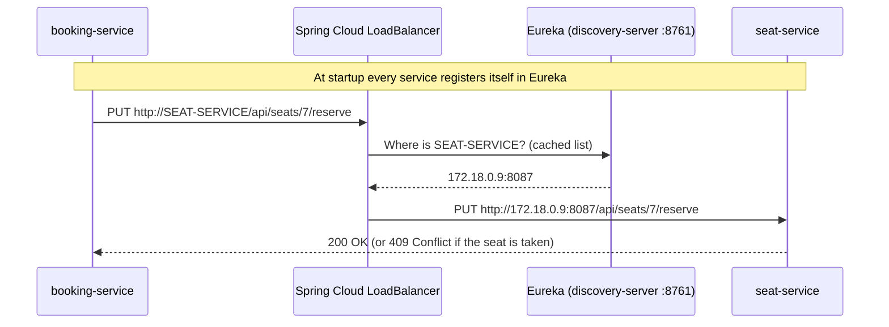

# How the services talk to each other

**Short answer: plain HTTP requests, using Spring's `RestClient`. Not OpenFeign.**

There is no OpenFeign dependency in any `pom.xml`, and no `@FeignClient` or
`@EnableFeignClients` anywhere in the code. Every call from one service to
another is a hand-written HTTP request.

---

## 1. The building blocks

A call between services uses four pieces together. Each calling service
declares them in its `pom.xml`:

| Dependency | What it does in this project |
| --- | --- |
| `spring-boot-starter-web` / `webmvc` | Provides `RestClient`, the object that sends the HTTP request |
| `spring-cloud-starter-netflix-eureka-client` | Registers the service in Eureka and downloads the list of other services |
| `spring-cloud-starter-loadbalancer` | Turns a service name like `http://SEAT-SERVICE` into a real address |
| `spring-cloud-starter-circuitbreaker-resilience4j` | Stops calling a service that keeps failing |
| `spring-boot-http-client` | Provides `HttpClientSettings`, used to set timeouts |

---

## 2. Two kinds of traffic

Requests travel in two ways. They are handled differently.

```
 Browser / frontend
        │
        ▼
 ┌──────────────┐   uri: lb://booking-service   (application.yml)
 │ api-gateway  │ ─────────────────────────────┐
 │    :8083     │   checks the JWT token        │
 └──────────────┘                               ▼
                                        ┌─────────────────┐
                                        │ booking-service │
                                        └─────────────────┘
                                          │            │
                    RestClient            │            │  RestClient
                    http://USER-SERVICE   ▼            ▼  http://SEAT-SERVICE
                               ┌──────────────┐  ┌──────────────┐
                               │ user-service │  │ seat-service │
                               └──────────────┘  └──────────────┘
```

| | Client → service | Service → service |
| --- | --- | --- |
| Who sends it | The browser, curl, the scripts | Java code inside a service |
| Goes through the gateway? | **Yes** | **No**, it goes straight to the other service |
| How the address is found | Gateway route `uri: lb://seat-service` | `RestClient` with base URL `http://SEAT-SERVICE` |
| JWT / ADMIN checks | Yes, in the gateway's `JwtAuthenticationFilter` | **None**, because the gateway is skipped |

Both use Eureka and the load balancer to find the service. The difference is
that internal calls never pass through the gateway. So a rule like "writing to
`/api/seats/**` needs ADMIN" does **not** block booking-service from
reserving a seat.

---

## 3. What happens during one call, step by step

Example: a user books a seat, so booking-service must reserve it in seat-service.



1. **At startup**, seat-service registers in Eureka as `SEAT-SERVICE`, using
   `eureka.client.service-url.defaultZone=http://localhost:8761/eureka/`.
2. booking-service builds a request to `http://SEAT-SERVICE/...`. This is
   **not** a real hostname. It is the name the service registered under.
3. The `RestClient` was built from a **`@LoadBalanced`** builder, so Spring
   Cloud LoadBalancer catches the request before it is sent.
4. The load balancer looks up `SEAT-SERVICE` in the copy of the Eureka
   registry that booking-service keeps locally. It picks one running
   instance.
5. The name is replaced with the real IP and port, and a normal HTTP `PUT` is sent.
6. seat-service handles it like any other request and returns a status code.

Because of this, **no host or port is hard-coded** in any caller. It also
explains why a service needs roughly 30 seconds after startup before others
can call it: it has to register in Eureka first, and the callers' local copy
of the registry has to refresh.

---

## 4. Every service-to-service call in the project

| Caller | Calls | HTTP request | Why | File |
| --- | --- | --- | --- | --- |
| auth-service | user-service | `POST /api/users` | Create the profile when someone registers | `auth-service/.../client/UserServiceClient.java` |
| auth-service | user-service | `GET /api/users/email/{email}` | Find the profile id for old accounts at login | same file |
| booking-service | user-service | `GET /api/users/{id}` | Check the user exists before booking | `booking-service/.../client/UserServiceClient.java` |
| booking-service | seat-service | `PUT /api/seats/{id}/reserve` | Reserve the seat (AVAILABLE → BOOKED) | `booking-service/.../client/SeatServiceClient.java` |
| booking-service | seat-service | `PUT /api/seats/{id}/release` | Give the seat back (BOOKED → AVAILABLE) | same file |
| payment-service | booking-service | `PUT /api/bookings/{id}/confirm` | Payment succeeded → confirm the booking | `payment-service/.../client/BookingServiceClient.java` |
| payment-service | booking-service | `PUT /api/bookings/{id}/cancel` | Payment failed / refunded → cancel the booking | same file |
| admin-service | user-service | `GET /api/users` | List all users on the admin screen | `admin-service/.../service/AdminServiceImpl.java` |

The other services (movie, theater, screen, showtime, seat, user) call **no one**.
They only receive requests.

---

## 5. Anatomy of a client class

All four callers follow the same pattern. Here is
`booking-service/src/main/java/com/example/bookingservice/client/SeatServiceClient.java`,
shortened:

```java
@Component
public class SeatServiceClient {

    private final RestClient restClient;
    private final CircuitBreaker circuitBreaker;

    public SeatServiceClient(
            @LoadBalanced RestClient.Builder builder,              // (1)
            CircuitBreakerFactory<?, ?> circuitBreakerFactory
    ) {
        this.restClient = builder
                .baseUrl("http://SEAT-SERVICE")                    // (2)
                .build();
        this.circuitBreaker = circuitBreakerFactory.create("seat-service"); // (3)
    }

    public void reserveSeat(Integer seatId) {
        circuitBreaker.run(                                        // (4)
                () -> { doReserveSeat(seatId); return null; },
                throwable -> { throw asRuntimeException(throwable); } // (5)
        );
    }

    private void doReserveSeat(Integer seatId) {
        try {
            restClient.put()                                       // (6)
                    .uri("/api/seats/{id}/reserve", seatId)
                    .retrieve()
                    .toBodilessEntity();
        } catch (RestClientResponseException ex) {
            if (ex.getStatusCode() == HttpStatus.CONFLICT) {       // (7)
                throw new SeatUnavailableException("Seat " + seatId + " is already booked");
            }
            throw ex;
        }
    }
}
```

1. **`@LoadBalanced`**: asks for the load-balanced builder. This qualifier is required. See section 6.
2. **`http://SEAT-SERVICE`**: the Eureka service name, not a real host.
3. **One circuit breaker per dependency**, named after the service it protects.
4. **Every request runs inside `circuitBreaker.run(...)`**, so failures are counted.
5. **The "fallback" just rethrows the original error.** It never invents a result. See section 8.
6. **The actual HTTP request**, written with `RestClient`'s fluent API.
7. **HTTP errors are turned into domain exceptions**, so the rest of the code
   deals with `SeatUnavailableException` instead of raw status codes.

Reading a response body works the same way. For example, auth-service reads the new profile:

```java
UserProfileDTO created = restClient.post()
        .uri("/api/users")
        .body(request)                  // Java object → JSON
        .retrieve()
        .body(UserProfileDTO.class);    // JSON → Java object
```

---

## 6. `RestClientConfig`: why there are two builders

Each of the four calling services has `config/RestClientConfig.java` with
**two** `RestClient.Builder` beans:

```java
@Bean
@Primary
public RestClient.Builder restClientBuilder() {             // plain, no timeouts
    return RestClient.builder();
}

@Bean
@LoadBalanced
public RestClient.Builder loadBalancedRestClientBuilder() { // for our own calls
    HttpClientSettings settings = HttpClientSettings.defaults()
            .withTimeouts(Duration.ofSeconds(2), Duration.ofSeconds(3));
    return RestClient.builder()
            .requestFactory(ClientHttpRequestFactoryBuilder.detect().build(settings));
}
```

| Builder | Used by | Load balanced? | Timeouts? |
| --- | --- | --- | --- |
| `@Primary` plain | Eureka's own HTTP client, which asks for `RestClient.Builder` by type | No | No |
| `@LoadBalanced` | Our client classes | Yes | 2s connect, 3s read |

If there were only the load-balanced builder, Eureka's own client would pick it
up and try to resolve `localhost:8761` as a service name.

> **Common mistake:** writing `RestClient.Builder builder` in a constructor
> without `@LoadBalanced`. Spring then injects the `@Primary` plain builder,
> and `http://SEAT-SERVICE` fails because nothing translates the name. This
> was a real bug in admin-service.

---

## 7. Timeouts

| Setting | Value | Meaning |
| --- | --- | --- |
| Connect timeout | 2 seconds | Give up if the other service does not accept the connection |
| Read timeout | 3 seconds | Give up if it connected but sends no answer |

Without timeouts, `RestClient` waits **forever**. One stuck service would hold a
thread in every caller until all threads are used up, and the problem would
spread through the whole system.

---

## 8. Circuit breaker

Configured in each caller's `config/ResilienceConfig.java` (Resilience4J):

| Setting | Value | Meaning |
| --- | --- | --- |
| Sliding window | last 20 calls | Failure rate is measured over the last 20 calls |
| Minimum calls | 10 | Do not judge until at least 10 calls have been made |
| Failure threshold | 50% | Open the circuit when half the calls fail |
| Wait when open | 10 seconds | Refuse all calls for 10s, then test again |
| Probes when half-open | 3 | Let 3 test calls through to see if it recovered |
| Time limit | 10 seconds | Longer than the HTTP timeout on purpose, so the HTTP timeout fires first |

The three states:

```
 CLOSED ──(≥50% of last calls fail)──► OPEN ──(after 10s)──► HALF-OPEN
   ▲                                   refuse instantly           │
   └──────────(3 probe calls succeed)─────────────────────────────┘
                                   (probes fail → back to OPEN)
```

### Errors that do NOT count as failures

```java
.ignoreExceptions(
        SeatUnavailableException.class,         // seat already taken (409)
        InvalidBookingReferenceException.class, // user does not exist (404)
        HttpClientErrorException.class          // any 4xx
)
```

A 4xx means the other service is **healthy** and correctly said "no" to our
request. Losing the race for a seat is the most common result when the system
is busy. If it counted as a failure, the circuit would open exactly when
everything is working correctly.

### No fake fallbacks

Every fallback rethrows the original exception. None of them returns a made-up answer:

- "Assume the user exists": the check becomes useless.
- "Pretend the seat was reserved": the seat gets booked twice.
- "Return an empty user list": the admin thinks there are no users.

Rethrowing the **original** exception also keeps its type, so the error
handler can still map it to the right status code. If `run()` were called
without a fallback, Spring Cloud would wrap everything in
`NoFallbackAvailableException` and every error would become a 500.

`spring.cloud.circuitbreaker.resilience4j.disable-thread-pool=true` is set in
`application.properties`, so the call runs on the request's own thread instead
of being handed to a separate pool.

---

## 9. What the original caller sees

Each service's `exception/GlobalExceptionHandler` turns the failure into an HTTP status:

| Situation | Exception | Status returned |
| --- | --- | --- |
| Seat already taken | `SeatUnavailableException` | **409** |
| User in the booking does not exist | `InvalidBookingReferenceException` | **400** |
| Other service is down, timed out, or answered 5xx | `RestClientException` | **502** (a dependency is broken) |
| Circuit is open, so the call was not even tried | `CallNotPermittedException` | **503** (retry later) |

`bash scripts/resilience-check.sh` measures this with user-service stopped.
The first bookings fail with **502 after ~2 seconds**, which is the connect
timeout. Once the circuit opens they fail with **503 in ~15 ms**, because no
call is attempted.

---

## 10. RestClient vs OpenFeign

With **OpenFeign** you would write only an interface, and the library would
generate the HTTP code:

```java
// NOT used in this project, shown for comparison only
@FeignClient(name = "SEAT-SERVICE")
public interface SeatClient {

    @PutMapping("/api/seats/{id}/reserve")
    void reserveSeat(@PathVariable Integer id);
}
```

With **RestClient**, as this project does it, you write the request yourself
(section 5).

| | RestClient (this project) | OpenFeign |
| --- | --- | --- |
| Style | Imperative: build and send the request in code | Declarative: an annotated interface |
| Amount of code | More | Less |
| Extra dependency | None, it is part of Spring Framework | `spring-cloud-starter-openfeign` + `@EnableFeignClients` |
| Service discovery | `@LoadBalanced` builder + `http://NAME` | `@FeignClient(name = "NAME")` |
| Handling a 409 | `try/catch` right next to the call | A separate `ErrorDecoder` class |
| Timeouts | `HttpClientSettings` on the builder | `spring.cloud.openfeign.client.config.*` properties |
| Circuit breaker | Explicit `circuitBreaker.run(...)` | `spring.cloud.openfeign.circuitbreaker.enabled=true` |
| Status | Actively developed, part of Spring Framework | Spring Cloud OpenFeign is considered feature-complete |

### If you want the interface style without Feign

Spring Framework has its own declarative clients, **HTTP Interfaces**
(`@HttpExchange`). They run on top of the `RestClient` you already have, so
the load balancer, timeouts and builders from sections 6 and 7 keep working:

```java
public interface SeatHttpClient {
    @PutExchange("/api/seats/{id}/reserve")
    void reserveSeat(@PathVariable Integer id);
}

// in a @Configuration class
@Bean
SeatHttpClient seatHttpClient(@LoadBalanced RestClient.Builder builder) {
    RestClient client = builder.baseUrl("http://SEAT-SERVICE").build();
    return HttpServiceProxyFactory
            .builderFor(RestClientAdapter.create(client))
            .build()
            .createClient(SeatHttpClient.class);
}
```

You would still wrap calls in `circuitBreaker.run(...)` and translate 409 into
`SeatUnavailableException` yourself. The project does not use this today.

---

## 11. Adding a new service-to-service call

Following the pattern the existing four callers use:

1. Add `spring-cloud-starter-loadbalancer`,
   `spring-cloud-starter-circuitbreaker-resilience4j` and
   `spring-boot-http-client` to the caller's `pom.xml`. The Eureka client is
   already in every service.
2. Copy `config/RestClientConfig.java` (both builders) and
   `config/ResilienceConfig.java` from booking-service. Adjust
   `ignoreExceptions` for your own domain exceptions.
3. Set `spring.cloud.circuitbreaker.resilience4j.disable-thread-pool=true`.
4. Create `client/<Target>ServiceClient.java`. Inject the builder **with
   `@LoadBalanced`**, use `http://<TARGET>-SERVICE` as the base URL, and wrap
   each request in `circuitBreaker.run(...)` with a fallback that rethrows.
5. Add `RestClientException` → 502 and `CallNotPermittedException` → 503 to
   the caller's `GlobalExceptionHandler`.
6. Check whether the target path has an ADMIN rule at the gateway. An internal
   call skips the gateway, so the rule will not apply to it.
